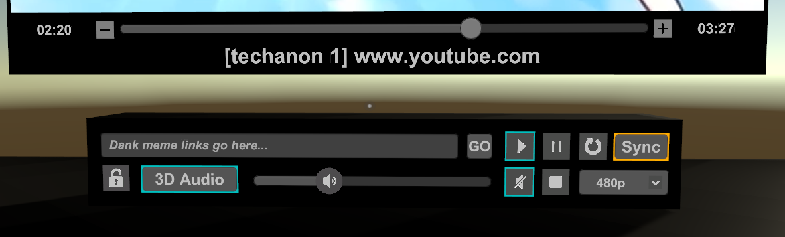
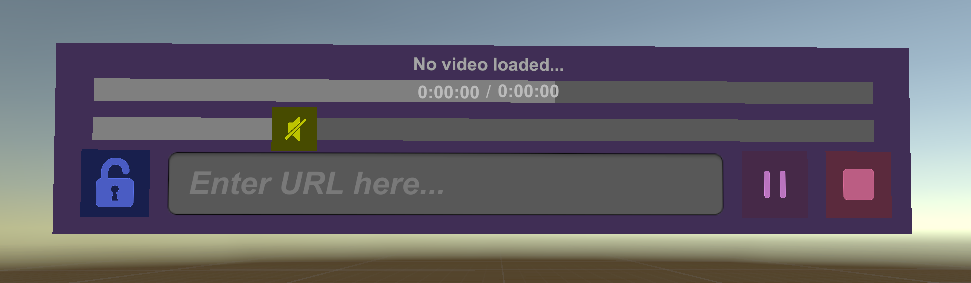
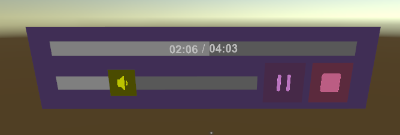
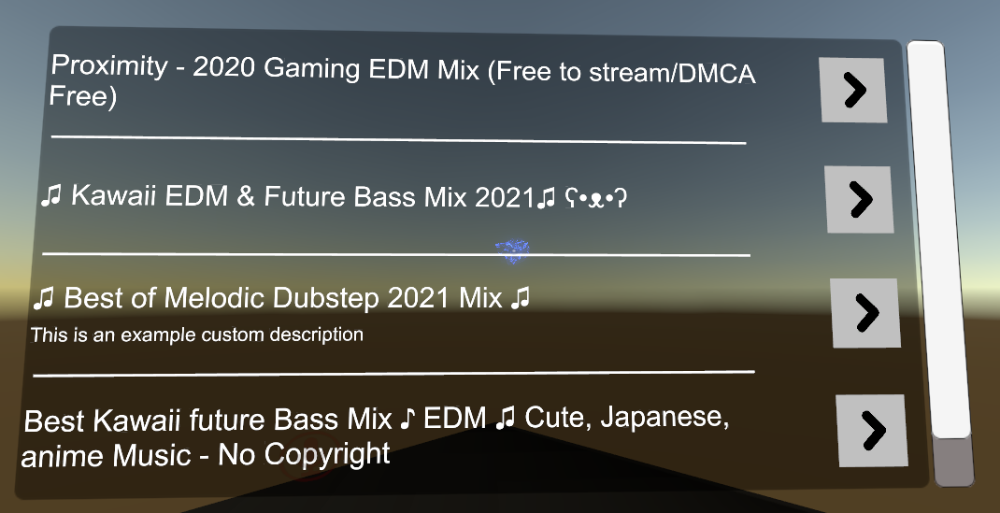
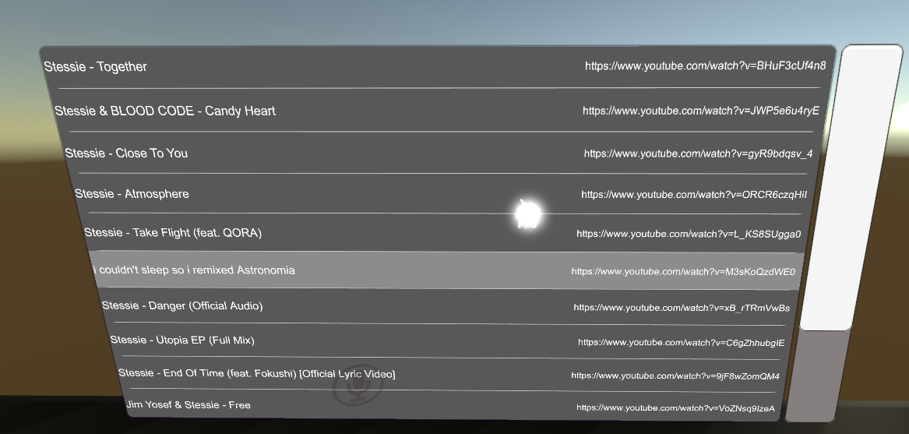

# Included Modules
The following are modules that integrate with the TV event system that are provided in this asset for out-of-the-box, plug-n-play use. You can have a look at the code or graph in each module to get a sense of how to integrate stuff with the TV event system.

## MEDIA CONTROL MODULES
---

## Basic UI Module
This module is the most familiar one as it is a rework of the media controls UI that originally came with TV 1.x.

The features of this module are:
- Customizable UI colors via an optional pallete system
- Standard Play/Pause/Stop buttons
- Volume control via slider and mute button
- Video owner and domain source display
- Video error display with helpful info
- Video seeking via slider and adjustment buttons (10 second increments)
- URL input field with a GO button (keyboard enter button not required)
- 3D/2D toggle for positional/stereo audio swapping
- Dropdown menu for managing the video player configuration swapping
- Timestamps for the current playing time and the ending time

This module doesn't do anything too fancy other than managing the visual state of its components to reflect the TV's current activity.

Note: If an error occurs, there will be some useful text that is displayed. If there is a PlayerError, it's likely that bad data was returned when trying to resolve the URL. Also double check that you didn't accidentally type extra characters into the text field after pasting. Such an input error has produced both InvalidURL errors and PlayerError errors during tests.

Here's what it looks like:  

## Slim UI Module (Recommended by Developer)
This module is media controls module, similar to the Basic UI Module, but is streamlined a bit.  
Compared to the basic module, it has removed the following interactions:
- 3D/2D audio swap
- Sync/Desync toggle
- Resolution swap
- Loop toggle
- Seek increment/decrement
- Mute toggle (volume slider remains though)

Here's what it looks like:  

## Slim UI Reduced Module
This module is a variation on the regular Slim UI. It has further removed the following interactions:
- URL inputting
- Master Lock Toggle
- Info display

This is intended to make it like a simple music player control. This does not feature a next/prev button set as that adds logical dependency on the playlist module, though it wouldn't take much to add them yourself.

Here's what it looks like:  

## PLAYLIST MODULES
---

## Simple Playlist Module
This module is a list of videos (external media URLs) that are pre-defined and setup ahead of time by the world creator. The UI uses an optional custom title, the video URL, and an activation button for each entry.

In the inspector, there is a listing of the video entries, some autoplay configuration options, and the tv reference.  
Firstly, when you add the Simple Playlist prefab to the scene, make sure to UNPACK COMPLETELY before doing anything. There are issues with the custom inspector on this module when not unpacked from the prefab.  
Secondly set the TV reference and autoplay settings as needed.  
Lastly add whatever videos you want to the playlist entries.
That's all you need to do.

If you want to hide the playlist visually, you can just disable the `Scroll View` node under the `Playlist` node. Pair this with the autoplay options to have a continuous playlist.

Here's what it looks like:  

## Sleek Playlist Module (Recommended by Developer)
Similar to the Simple Playlist Module, this allows you to specify a list of urls/titles for videos in a list format. This playlist also features a progress bar behind the playlist items that shows the status of the media that is currently loading, allowing indication of the currently playing playlist item.

Here's what it looks like:  

## Playlist Queue Module
Development In-Progress