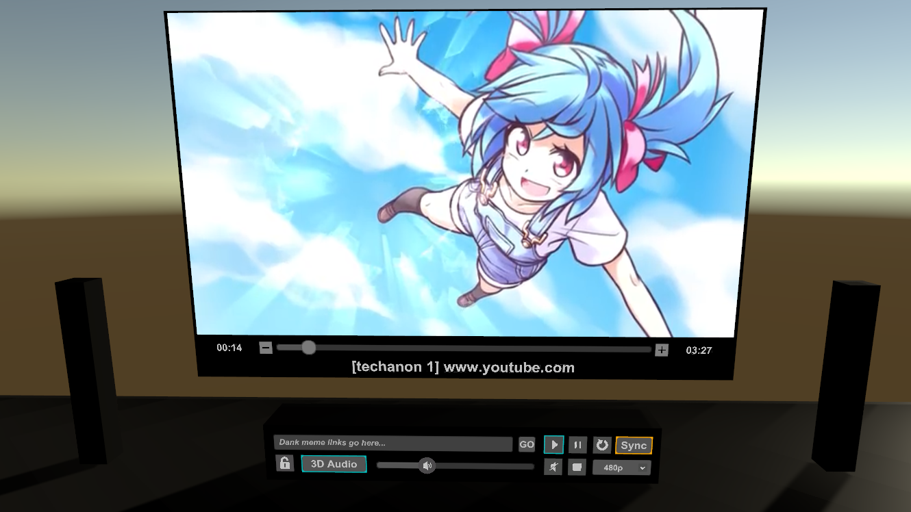
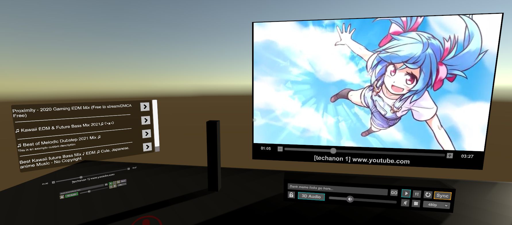
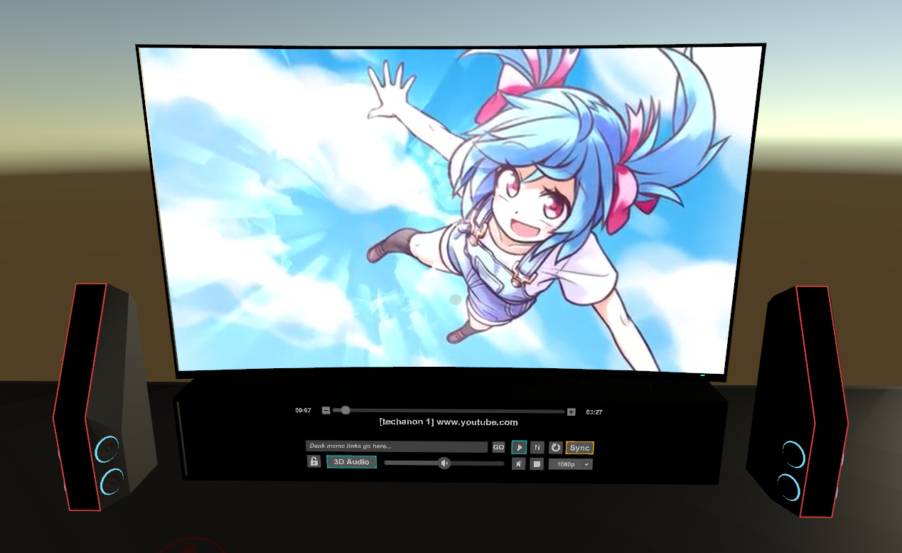
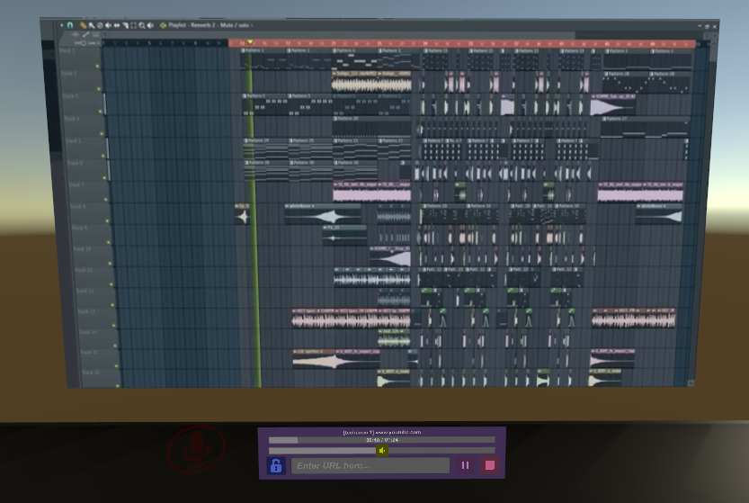
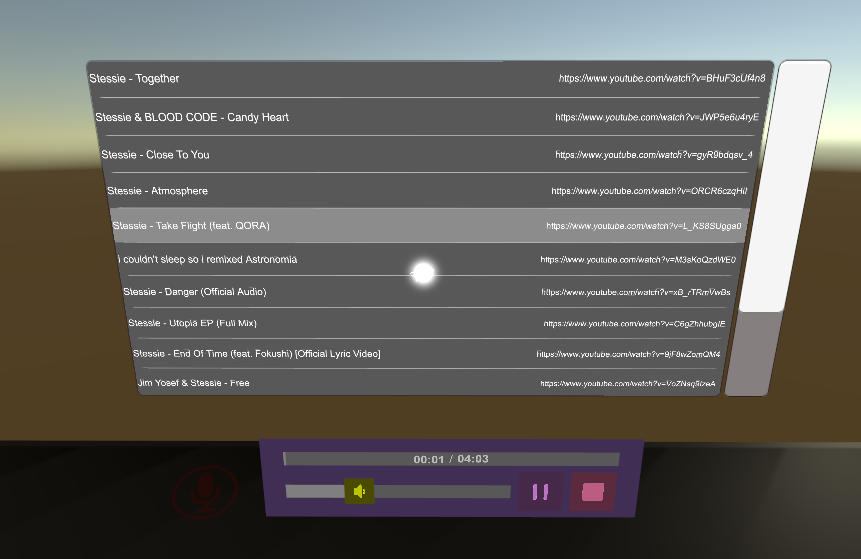

# Ready-made off-the-shelf TVs

## TV2.0 Standard Multi-Res
This prefab is the standard, well-known setup brought over from the 1.x series. It contains the TV2.0 Base and the Basic UI module.

Here's what it looks like:  

## TV2.0 Multi-Subscriber Exmaple
This prefab is a variation on the standard, and mostly provided as a learning example on how to hook up multiple modules to a single TV. This prefab also features two additional video players to swap between: A multi screen player (one big screen with two smaller screens to the sides), and an implementation of the default Unity player (as opposed to the usual AVPro backend).

Here's what it looks like:  

## TV2.0 Custom TV Model
This prefab is a variable on the standard, but features a custom TV model instead of the old box/quad primitives setup from 1.x. Each of the screen meshs are updated to the TV's screen mesh for seemless positioning. It uses the Basic UI Module as it's controls.

Here's what it can look like:  

## TV2.0 Slim (Recommended by Developer for Most Worlds)
This prefab is a model-less variation on the standard. It uses no "physical" models, just the screens. It comes with the Slim UI Module as it's controls.

Here's what it looks like playing a video:  

## TV2.0 Music Player
This prefab is built like a music player. It has all screens removed and features both the Slim Playlist module and the Slim UI Reduced module as it's controls.

Here's what it looks like:  

